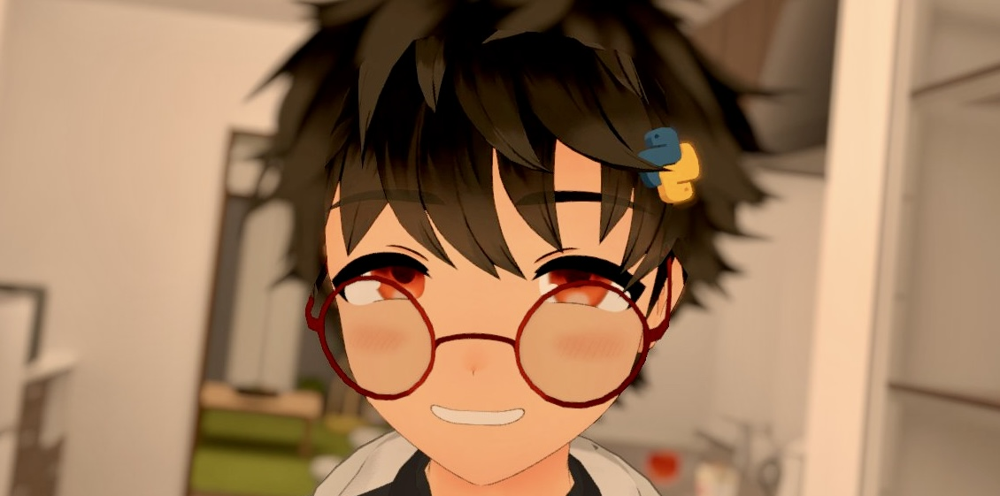

# GesonAnko (Yasuhiro SHIMOMURA)

  

(Avatar: [**"ENTo"** made by ゆどのん工房](https://booth.pm/ja/items/5938569) )

## Profile

自律機械知能 (Autonomous Machine Intellgence, AMI) の研究開発を行っています。機械学習、自律AI、ロボティクス領域が専門です。

また、プログラミング言語は [**Python**](https://www.python.org) に熟達しており、自律機械知能の研究に関連した堅牢かつ複雑なシステム・ライブラリの開発も行っています。

2024年4月より [ジー・オー・ピー株式会社 / GOP co., ltd.](https://www.gop.co.jp)に所属。業務を行いつつ、弊社のスポンサーのもと研究開発を行っています。

### Links

* **Development**
  * [<i class="fab fa-github"></i> GitHub (Geson-anko)](https://github.com/Geson-anko): 趣味で開発したものを置いています
  * [<i class="fab fa-github"></i> GitHub (MLShukai)](https://github.com/MLShukai): チームでの開発や研究に用いるメンテナンスを行うものを置いています。

* **Blogs**
    * [<i class="fas fa-pen-square"></i> Qiita](https://qiita.com/GesonAnko): ライトな技術記事です
    * [<i class="fas fa-book"></i> Zenn](https://zenn.dev/gesonanko): 割とマニアックなところまで書きます。
    * [<i class="far fa-sticky-note"></i> note](https://note.com/gesonanko): VRChatや詩的な文章、ターゲットが技術者ではない場合に書きます。

* **Social**
    * [<i class="fab fa-twitter"></i> X (Twitter)](https://x.com/GesonAnkoVR): 雑多に呟きます。

* **Discord**
    * [<i class="fab fa-discord"></i> ML集会](https://discord.gg/bDW3Xhj6f7): 私の活動するDiscordサーバです。チームでの開発などもここで行っていることが多いです。

### Contacts

- Email (仕事用): shimomura.yasuhiro@gop.co.jp

## Pick Ups!

注目のプロジェクトやアクティビティをご紹介します。

## Awards

これまでに受賞した賞やコンテスト実績などを紹介します。

## Direction

現在の研究方針や今後の展望について説明します。

## Developments

開発したプロジェクトや貢献したソフトウェアを紹介します。

### Contributions

オープンソースプロジェクトへの貢献内容を共有します。

## Researches

研究内容や発表論文、研究成果についての詳細な情報を提供します。

## History

経歴や学歴、これまでの活動履歴をまとめています。

